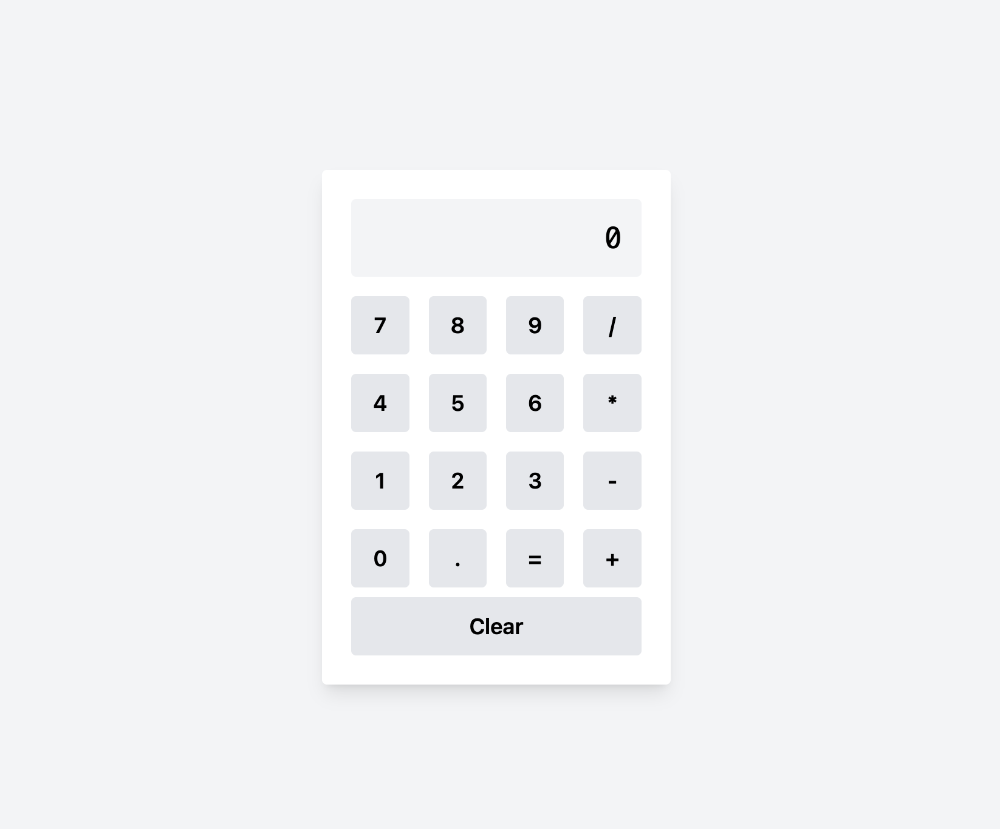

# [https://calculator-app.vercel.app/](https://calculator-phi-nine-22.vercel.app/)

# Calculator App

This is an application for a technical test where React and TypeScript are used for its development, along with Tailwind CSS to demonstrate design skills.

## Getting Started

### Prerequisites

- Node.js (v16+)
- npm o yarn

### Installation

1. Clone the repository:
   ```bash
   git clone https://github.com/AdolfoCBasilio/calculator-app.git

2. Install dependencies:
   ```bash
   npm install
   ```
   or
   ```bash
   yarn install
   ```
### Running the Application

3. To start the application, run:
   ```bash
   npm start
   ```
   or
   ```bash
   yarn start
   ```
### Design and Architecture
The application follows a modular architecture with the following main components:

- **components/**: Reusable UI components.
- **hooks/**: Custom hooks for managing logic.
- **styles/**: Global styles.

### Technologies Used

- React
- TypeScript
- Tailwind CSS
- Custom Hooks
- Responsive Design

### Features

- Basic calculator operations: addition, subtraction, multiplication, and division.
- Error handling, such as division by zero.
- Simple and responsive user interface.
- Safe evaluation of mathematical expressions without using eval.

### License

This project is licensed under the MIT License.

### Screenshots


### Contact
You can reach me at: [ [LinkedIn](https://www.linkedin.com/in/adolfocbg/) ]
